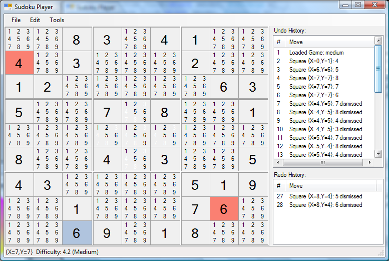

Yet Another Sudoku App is a project which allows users a chance to visualize games differently than standard sudoku clients. It has a built-in game generator and solver, but it's primary purpose is to assist with solving sudoku puzzles. It's written in c#.

There were a number of goals I had when creating this project. One goal was education - it's a good way to keep my brain from turning to mush after writing CRUD apps all day :) 

But another big reason was to scratch an itch I get whenever solving a sudoku puzzle online. I always feel too limited; I would like the ability to mark up the board as if I were working on the puzzle on paper. There are a couple online clients for this, but none were powerful enough for me. One need I have is the ability to mark off values for squares which are not possible. Another thing I needed was a game history (i.e. the ability to undo/redo). There are other things that can be added to the client which will assist in solving sudoku puzzles, but for now, those are the two main things.

The source code is structured in a way which keeps the UI code separate (for the most part) from the core logic of the application. Right now, the client is written using traditional WinForms, but it is my hope that, eventually, the core code can be utilized by other clients (e.g. WPF/Silverlight).

I also want to mention here that the undo/redo functionality was implemented using another project here on CodePlex http://dejavu.codeplex.com/. The DejaVu project seems pretty solid, and the guy running the project put a lot of care into his work - so it's worth checking out.

Finally, regarding participation, please feel free to check-out the source code. Feedback would be great (like I mentioned above, I don't get a lot of opportunities to do algorithmic stuff - so I'm sure some optimization is needed). Also, if you want to contribute, that would be cool too. I'm a little rusty when if comes to WPF/Silverlight, so if you're itching to help out, you might want to take a crack at that first.

Thanks for stopping by!
